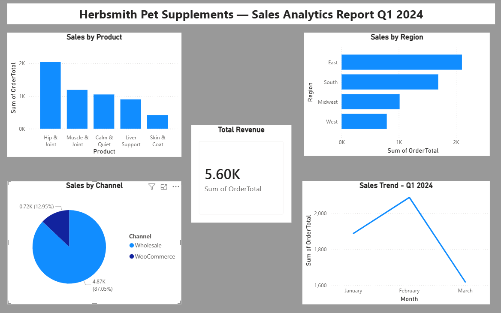

# 📊 Power BI Sales Analytics Dashboard
### Herbsmith Pet Supplements — Q1 2024 Sales Report

---

## 📌 Project Overview

This Power BI dashboard analyzes Q1 2024 sales order data for a pet supplement distribution company. The report transforms raw sales data into actionable business insights — covering product performance, sales channels, regional breakdown, and monthly revenue trends.

This project mirrors real-world ERP and WooCommerce sales data workflows used in business operations environments.

---

## 🖼️ Dashboard Preview

---

## 🎯 Business Questions Answered

- Which product line generates the highest revenue?
- What percentage of sales come from Wholesale vs WooCommerce?
- Which region is the strongest market?
- How did sales trend month over month in Q1 2024?

---

## 📈 Key Insights

| Insight | Finding |
|---|---|
| 🏆 Top Product | Hip & Joint — $2K in sales |
| 📦 Top Sales Channel | Wholesale — 87% of total revenue |
| 🗺️ Top Region | East region leads all markets |
| 📅 Peak Month | February 2024 |
| 💰 Total Q1 Revenue | $5,600 |

---

## 🔧 Tools Used

- **Power BI Desktop** — Report building and data modeling
- **Power Query Editor** — Data cleaning and transformation
- **CSV Data Source** — Simulated Sage 100 / WooCommerce export

---

## 📊 Visuals Built

- **Sales by Product** — Clustered Column Chart
- **Sales by Channel** — Pie Chart (Wholesale vs WooCommerce)
- **Sales by Region** — Horizontal Bar Chart
- **Sales Trend Q1 2024** — Line Chart (January → March)
- **Total Revenue** — KPI Card ($5.60K)

---

## 💼 Business Context

This dashboard simulates the kind of reporting used in ERP-driven business operations environments — where sales order data from systems like **Sage 100** and **WooCommerce** is analyzed to support decisions around inventory planning, channel strategy, and regional sales focus.

---

## 👤 About the Author

**Sharon Paul**
IT & ERP Business Systems Professional | Milwaukee, WI
Skills: Power BI · SQL · Excel · Sage 100 ERP · WooCommerce · Business Analysis

🔗 [SQL Business Analytics Portfolio](https://github.com/sharonpaul604-wq/sql-business-analytics)

---

*This project is part of an ongoing portfolio building journey toward a Business Systems Analyst / ERP Support Specialist role.*
